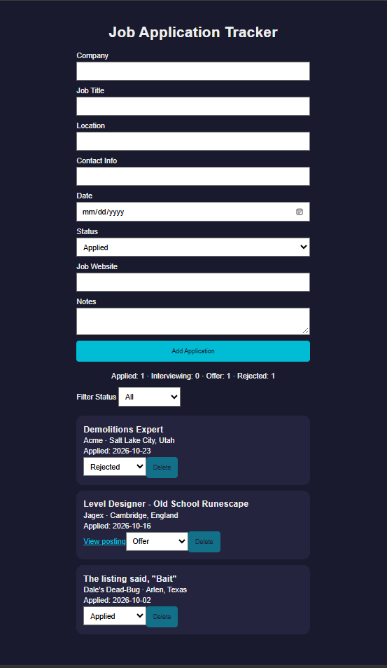

# Job Application Tracker
The tracker takes information input into the form by the user, then saves and displays the information in the card. I built this as a way to keep track of my job hunting experience.

[Live site](https://j-winchester94.github.io/job-tracker/)

## Features
- Adds applications to cards
- Saves applications between visits
- Updates an application's status
- Deletes saved applications
- Asks for confirmation before deletion
- Filters applications by status
- Displays summary counts

## Built with
- HTML5
- CSS
- Vanilla JavaScript
- localStorage

## What I learned
Finally learning Git has been a game changer, and helped me overcome much of the tedium that I had before. I also learned about how to render form data, working with the DOM, how to save data using localStorage and JSON, and, of course, debugging with the console. 

## Future improvements
I would really like to update the style for mobile where I can flip between applications like actual cards. Maybe also create a popup menu that only displays them when interacted with. I would also like for this form to be put on a backend server with a password and display the statuses on my portfolio website. Perhaps I could give a potential employer FOMO.